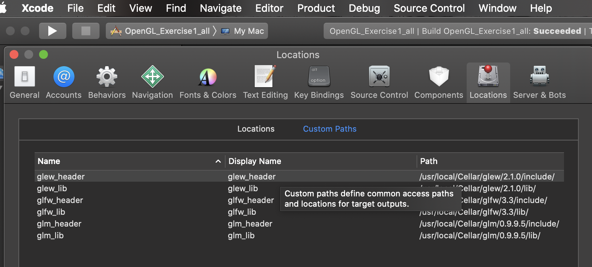
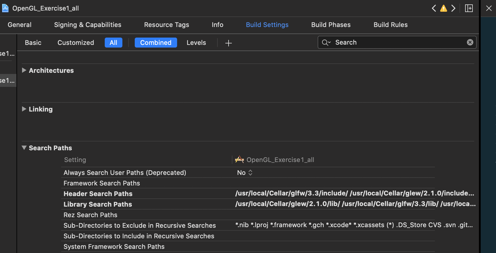
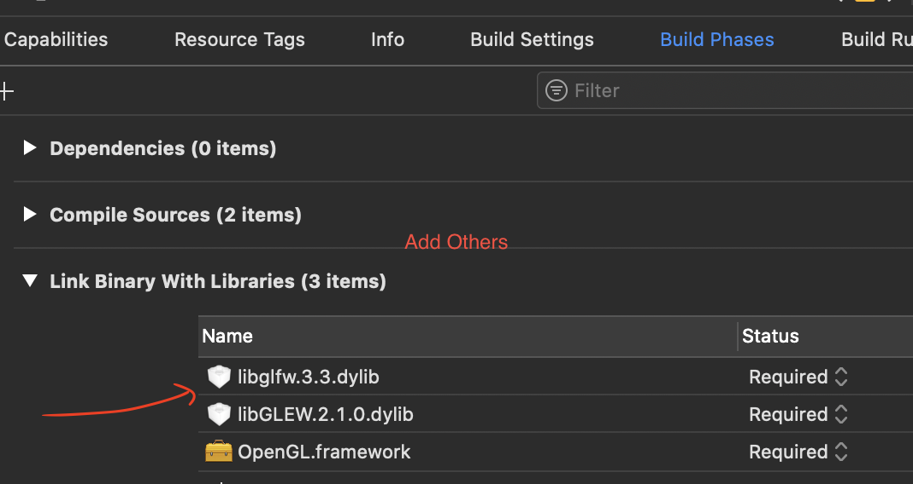

# OpenGL_goon
study from  https://learnopengl.com/

## step1 安装GLEW和GLFW库
```
brew install glew
brew install glfw3
```
## step2 下载GLAD库
打开GLAD的[在线服务](http://glad.dav1d.de/)，将语言(Language)设置为C/C++，
在API选项中，选择3.3 以上的OpenGL(gl)版本。之后将模式(Profile)设置为Core，并且保证生成加载器(Generate a loader)的选项是选中的。都选择完之后，点击生成(Generate)按钮来生成库文件。

## step3 配置xcode
在Xcode中找到Peference菜单项，然后在里面找到Locations项，再点击Custom Paths
配置依次为


## step4 更改头文件和库搜索路径


## step5 导入framework

添加两个dylib文件的方法是，在你没有在framework中搜索到这两个文件时，点击add other，然后点击shift+command+G进入/usr/local文件夹，然后根据我们之前说的安装glew和glfw3的路径找到这两个文件夹，在这两个文件夹中找到这两个文件
brew 下载的一般是 /usr/local/Cellar/glew/2.1.0/include/ 可看step 3 步骤

## step6添加头文件
#include <GL/glew.h>
#include <GLFW/glfw3.h>

glad 我是直接放在目录里面的
#include "glad.h" 然后把头文件改了都是用户文件的